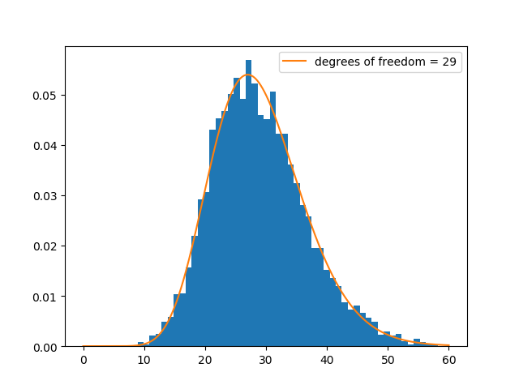

# crypto senior sem
### From cryptography to cryptocurrencies

This course is about the state-of-the-art in modern cryptography, which
finds application as the primary mathematical apparatus that has, of late, been
artfully fashioned into cryptocurrencies.  Cryptography is of course pervasive and
ubiquitous in the technological age, so that this course is ultimately about
certain cutting-edge information-theoretic advancements that are reshaping our
world.  In addition to crytographic primitives, their prevailing applications,
and underlying mathematics, topics include applications of zero-knowledge proofs
and their role in present-day FinTech.

Important: as far as speculating in cryptocurrencies, we think that you are likely
better off not doing so. Whether or not you take that advice, you might
do well to look under the hood of the new-fangled tech that is built atop a rather
striking assemblage of pure and applied Math and CS.

## Preliminaries

### Getting started

* First, install [polylib](https://github.com/sj-simmons/polylib),
* then install [numlib](https://github.com/sj-simmons/numlib),
* then read on.

### The integers modulo n

Let  be a fixed positive integer. We say that integers  and  are
*congruent* modulo  if  divides their difference,  and we write 
For instance, 

One can consider the
[ring](https://en.wikipedia.org/wiki/Ring_(mathematics)) of integers modulo 
denoted  or, more succinctly, 
Congruence modulo a given  defines an
[equivalence relation](https://en.wikipedia.org/wiki/Equivalence_relation)
on the integers and, as a set,  consists precisely of the resulting
equivalence classes.

An equivalence relation partitions a set into disjoint subsets. For instance, 
consists of 5 equivalence classes  where, for example,

<p align="center"></p>

Congruence modulo  is more than just an equivalence relation. The familiar
algebraic (ring) structure of the integers consistently descends to equivalence
classes; e.g.,  and  in  Notationally, we usually
drop the square brackets and write, for example,  or just  if
we know we are in 

In Python, one can use the percent-sign operator to work modulo :
```python
>>> 123 % 45
33
```
Alternatively, one can use numlib to work in  as follows.
```python
>>> import numlib as nl
>>> R = nl.Zmod(45)
>>> R
Z/45
>>> R(123)
33 + <45>
```

### Pseudorandom number generation

This is an aside but, as a simple application, let us implement a
[Linear Congruence Generator](https://en.wikipedia.org/wiki/Linear_congruential_generator).
*Linear congruence* here means that we generate the next "random" output by applying
a linear function to the state and taking the result modulo some fixed large number.
It doesn't matter as much in Python3, but for C or say Rust, it makes good sense to
mod by the large number   Here is some code that implements an LCG using numlib:

```python
#lcg.py
import numlib as nl

# set the modulus
m = 2**64
R = nl.Zmod(m)  # R is now the ring of integers modulo 2^64

# set parameters of the linear congruence generator including initial state:
a = 123456789
c = 12121212121
state = R(10**10+1)  # an element of R

def prng():
    """Return the next sequential integer between 1 and m, inclusive."""
    global state
    state =  a * state + c
    return state + 1
```
Copy the code block above a file called **lcg.py**.  Then the following program,
when run in the same directory, prints 5 randomly generated numbers.
```python
from lcg import prng

for _ in range(5):
    print(prng())

#1234567902244668911
#8826425326919980896
#10890877254142952101
#15231402302547497038
#10264820975732655147
```
One can think of the above implementation of a LCG a generated pseudo-random
*sequence* of numbers.  Due to the initial seed being 10000000001, the
determinism is exhibited rather explicitly in the first number of the output.
Of course, the next number is completely determined by the current state in
any case.

The quality of "randomness" in the sequence generated by an LCG such as the one
above, or any PRNG, is a bit subtle to assess.  A battery of tests is often deployed
when trying to detect bad RNGs.

Since there are only  possible outputs, the period of the random number
generator**prng** is **at most** 

Important: the PRNG above is *not* a CSPRNG &mdash; a
*cryptographically secure random number generator &mdash; hence it is not
of suitable quality for crytographic applications.

In fact, it may not even have the largest possible period (which is ). In
the code block above, one can guarantee that the period is in fact as large as
possible using the Hull-Dobell Theorem; i.e., be ensuring that

*  and  are relatively prime,
*  is divisible by all prime factors of , and
*  is divisible by 4 if  is divisible by .

#### Exercise
1.1. Does the LCG defined above satisfy all three bulleted conditions?

A common test to gauge whether a PRNG is worthy of the term "random" employs the
[Chi-squared distribution](https://en.wikipedia.org/wiki/Chi-squared_distribution),
which works as follows.

Suppose that we partition the possible outputs into a small number of *cells* (or
*bins*). We can then use the LCG to generate a large sample of values and tally
how many land in each bin.

```python
from lcg import prng

sample_size = 12000
bins = 30 # we will split the sampled random numbers into equal bins

sample = [prng()//(2**64//bins) for _ in range(sample_size)]

def get_frequencies():
    frequencies = dict()
    for bin_ in sample:
        frequencies[bin_] = frequencies.get(bin_, 0) + 1
    return list(frequencies.values())

print(*get_frequencies())
```
The output is
```
410 401 448 376 398 388 399 408 410 371 402 395 388 412 389 422 410 406 412 398 404 404 395 364 408 390 416 369 420 387
```
It appears that the numbers generated are fairly evenly distributed
across the 30 bins so that our PRNG appears to sample uniformly.  One the
other hand, note that we should be concerned if each bin contained exactly the
same number (400) of sample values; we wouldn't expect that even from an
actual (uniform) random number generator.

One way to analyze whether we have enough, but not too much, variation in
the frequencies is to compute the test statistic

<p align="center"></p>

where  is the observed frequency of values falling in the th bin.
For a legitimate PRNG, this statistic follows a chi-squared distribution with
degrees of freedom equal to one less than the number of bins.

The sampling distribution (over 5000 samples) for the  statistic for our
PRNG looks like this:

<p align="center">
  
</p>


### Prime fields

Note that  in  so, 2 has 11 as its multiplicative inverse.
Meanwhile  can have no multiplicative inverse since it is a zero divisor in
 If every nonzero


### Generating primes

We will need some prime numbers that are fairly large  &mdash; 200 bits, say, for now; so primes of size
around 

One way to generate such a prime would be to iterate through numbers larger that  until we
find one that is prime.  Alternatively, one could randomly generate sequences of zeros and ones of
length 200 and check if the corresponding decimal number is prime.  Python has a built-in function that
generates an integer from random bits:

```python
import random
decimal = random.getrandbits(200)
```
Of course, depending on whether the most significant random bit was zero or one, we might get a number somewhat
less than  so let us set the most significant bit to one and, while we are at it, set
also the least significant bit to 1 since primes beyond 2 must be odd:
```python
decimal |= (1 << numbits - 1) | 1
```
The variable **decimal** is now an integer whose binary representation has length 200 and both begins
and ends with 1; i.e., **decimal** is a random (depending on the robustness of **getrandbits**)
odd integer strictly between  and 

Beyond using the fact that a prime larger than 2 must be odd, there are various other quick ways
to test whether a candidate odd integer  is *likely* prime.  These include
[Fermat's primality test](https://en.wikipedia.org/wiki/Fermat_primality_test) which checks to see
if  *acts like* a prime: namely, whether  for  equal,
in turn, to say 2, 3, and 5, as would be the case, by Fermat's Little Theorem (see below), if 
were in fact prime.

Rather than implement Fermat's and related primality tests yourself to detect whether **decimal** is prime,
feel free to use [numlib](https://github.com/sj-simmons/numlib)'s implementation:

```python
import numlib
numlib.isprime(decimal) # True or False according to whether decimal is prime
```
#### Exercise
1. Replace the  above with say  and write a function, using the scheme outlined above, that returns a -bit prime.

At issue is the fact that larger primes are harder to find. The difficulty is gauged by the Prime
Number Theorem.  If we define  to be the number of primes less than or equal to , then
the theorem states that  is well-approximated by  in the sense that
<p align="center"></p>

The Prime Number Theorem implies that the number of primes between  and 
is approximately

<p align="center"></p>

hence, the probability of a randomly chosen number between  and  being
prime is approximately   But since your
program from exercise 1 doesn't bother with even numbers, a given candidate **decimal**
has a likelihood of about  of being prime.
It is an elementary fact from probability theory (see e.g., section 2.1 of
[primer on random variables](https://github.com/sj-simmons/probthry/blob/main/primer.pdf)) that,
on average, one expects to test about  numbers before turning one up that is
indeed prime.

#### Exercise
2. Write a program that verifies that the expected number of tries before your function from exercise 1 returns a prime is about .

Note: since  is small, the variance here is very large so that the time it takes for your
program to find a single prime can vary greatly.

### Euler's Theorem

This is a basic result:

**Fermat's Little Theorem**:  If  is a prime and  is an integer not divisible by , then .

For those who know a little group theory this follows immediately from the fact that the order of
any element of a finite group must divide the order of the group. Here the relevant group is
, the multiplicative group of units in ,
which has order 

If you are not familiar with basic group theory, then see for example
[this wikipedia page](https://en.wikipedia.org/wiki/Proofs_of_Fermat%27s_little_theorem)
for various other proofs of Fermat's Little Theorem.

#### Exercise
3. Use your program above to generate a 200-bit prime  and then verify that the  where  is, say, 1234567, or any positive integer less than . Note: you may wish to use Python's built-in [pow() function](https://docs.python.org/3/library/functions.html#pow).

Below we will need the following generalization of Fermat's Little Theorem.

**Euler's Theorem**:  If  is positive integer and  is an integer relatively prime to ,
then .

Here  is the Euler Phi function which returns the number of positive integers less than
and relatively prime to .
Notice that Euler's Theorem specializes to Fermat's Little Theorem if  is prime since, then,
  Moreover, Euler's Theorem also follows from basic group theory where the ambient
group is , the multiplicative group of units in ,
which has order 

### Public-key Cryptography

In modern times, you can create and publish (on, say, your personal webpage) a *public key* that
can then be used (by, say, someone called Athena) to encrypt a private message to you.  You can decrypt
Athena's message but no else can, so it doesn't matter if a bad actor sees Athena's encrypted message
that she is sending to you.

Important: since your enciphering key is public, a bad actor might try to intercept Athena's message
and replace it with a malicious message encrypted with your public key. Then you encrypt the bad actors
message thinking that it is from Athena.  We need to bar against this weakness but, for now, let us
ignore it.

To create your public key, you first choose two large primes  and  (which you will keep
secret) and multiply them together obtaining .  You also choose a positive integer  that is relative
prime to .  Your public key then consists of the pair of numbers .

Now suppose that  is a positive integer representing the message that Athena wants to encrypt and
send to you.  If  is the numeric version of your message, then we encrypt 

Now, in order for you to decrypt Athena's message you must (see below) derive your
So how is it that your public key can't be reverse engineered by a bad actor

And example

* ECC (Elliptic Curve Cryptography
  * [A gentle intro to ECC](https://andrea.corbellini.name/2015/05/17/elliptic-curve-cryptography-a-gentle-introduction/)
  * Neal Koblitz's 1985 paper [Elliptic Curve Cryptosystems](https://www.ams.org/journals/mcom/1987-48-177/S0025-5718-1987-0866109-5/S0025-5718-1987-0866109-5.pdf)

* Potentially relevant
  * MC Frontalot's [Secrets of the future](https://www.youtube.com/watch?v=FUPstXCqyus)

#### Cryptocurrencies
* [Chart showing which coins use which flavors of cryptography and curves](http://ethanfast.com/top-crypto.html)

* Literature
  * [The Mathematics of Bitcoin](https://arxiv.org/abs/2003.00001)

#### Zero knowledge
* [math primer](http://extropy.foundation/workshops/zkp/primer.html)

#### More literature
* [evervault.com/papers](https://evervault.com/papers)

## Tools/tutorials

#### Quick start on making basic  number-theoretic/cryptography computations in high-performance Python
* Install the multi-precision library [gmpy2](https://gmpy2.readthedocs.io/en/latest/intro.html)
  in a Debian-like environment such as Ubuntu by issuing, at your commandline, the command
  ```shell
  sudo apt install gmpy2
  ```
* Then, if you say want to generate some large primes in Python:
  ```python
  import gmpy2

  randstate = gmpy2.random_state(1728)

  def getprime(nbits):
      """ Return an n-bit prime of type mpz. """
      return gmpy2.next_prime(gmpy2.mpz_rrandomb(randstate, nbits))
  ```
  The function **getprime()** generates primes. Let us check that they are roughly n-bits.
  ```python
  import math

  for _ in range(10):
     p = getprime(128)
     print(f'{p}  approx. bit-length: {math.log2(p)}')

  # output:
  # 170141183460778792299372374151321878621  approx. bit-length: 127.00000000000263
  # 340281722954356176270385562639172354083  approx. bit-length: 127.9999972697725
  # 340282366920938463463374607431768080437  approx. bit-length: 128.0
  # 340282366920938461102191365996962381853  approx. bit-length: 128.0
  # 340282366919700523719237132310450012183  approx. bit-length: 127.99999999999476
  # 329648544222309736707797093892948492193  approx. bit-length: 127.95419631593471
  # 338953138926372144816642355375684713631  approx. bit-length: 127.99435343686405
  # 340282366920937254539860835811807199379  approx. bit-length: 128.0
  # 170141183460470440657506916146035556433  approx. bit-length: 127.00000000000001
  # 340282366920937292316486855759755210761  approx. bit-length: 128.0
  ```
* Now suppose that we want to (naively) pick two large primes, set up an RSA
  encryption scheme, and encode the message 98765432123456789.
  ```python
  p, q = getprime(128), getprime(128)
  n = p * q  # type mpz

  phi = (p - 1) * (q - 1) # keep this secret

  # find a (naive) encryption key
  e = 1
  while (e < 2 or gmpy2.gcd(e, phi) != 1):
    e = gmpy2.mpz_random(randstate, phi) # type mpz

  assert gmpy2.gcd(e, phi) == 1  # (e, n) is our public key

  m = 98765432123456789 # our message

  c = gmpy2.powmod(m, e, n) # m^e (mod n) our ciphertext (encrypted message)
  ```
* Lastly, let us check things by finding a deciphering key and decrypting the message.
  ```python
  _, d, _ = gmpy2.gcdext(e, phi) # d is our deciphering (private) key
  d = gmpy2.t_mod(d, phi)  # we only need d modulo phi

  # Note: the function gcdext used above applies the extended Euclidean algorithm;
  # i.e., gcdext(e, phi) returns a triple of integers (gcd(d, phi), d, f) satisfying
  #                    gcd(e, phi) = d * e + f * phi.
  # Since gcd(e, phi) = 1, d is just the multiplicative inverse of e (modulo phi)

  assert gmpy2.t_mod(d*e, phi) == 1

  # Alternatively, one can compute d with
  #                    d = gmpy2.inverse(e, phi)

  print(gmpy2.powmod(c, d, n)) # c^d (mod n) = 98765432123456789
  ```
#### Use Simmons' [numlib](https://github.com/sj-simmons/numlib) to instantiate and compute, in Python, in a finite field or in an elliptic curve over a finite field.
*  First install the library by typing, at your commandline,
   ```shell
   pip install polylib --user
   pip install numlib --user
   ```
*  Then, you can create in Python a primefield (i.e., Z/pZ where p is a prime) of order say 2027:
   ```pycon
   >>> import numlib as nl
   >>> PF = nl.Zmodp(2027)
   >>> PF  # Z/2027
   >>> x = PF(100)
   >>> x   # 100 + <2027>
   >>> x**1000  # 2022 + <2027>
   >>> x**-1  # 750 + <2027>
   ```
* Instantiate an work in a Galois field of order 7^3:
  ```pycon
  >>> GF = nl.GaloisField(7, 3)
  >>> GF  # Z/7[t]/<t^3+3t^2-3>
  >>> t = GF.t()
  >>> t   # t + <t^3+3t^2-3>
  >>> t**1000  # -3t^2+3t+2 + <t^3+3t^2-3>
  >>> t**-1  # -2t^2+t + <t^3+3t^2-3>
  ```
* Work in an elliptic curve over the Galois field of order 7^3:
  ```pycon
  >>> E = nl.EllCurve(t**2+5*t+2,t-2)
  >>> E  # y^2 = x^3 + (t^2-2t+2)x + (t-2) over Z/7[t]/<t^3+3t^2-3>
  >>> E.j  # 3t^2+t+3
  >>> # Let us list a few point on this curve:
  >>> finite_points = list(nl.finite(E)) # nl.finite(E) is a generator
  >>> for point in finite_points:
  ...     print(point)
  ...
  (-t^2-t-2, -3t^2-3t-3)
  (-t^2-t-2, 3t^2+3t+3)
  (2t^2-t+3, -2t^2-3t-3)
  (2t^2-t+3, 2t^2+3t+3)
  (3t+2, -3t-3)
       ...
  >>> len(finite_points)  # this curve has order 320 (including the point at infinity)
  319
  >>> # Let's pick point and find its order
  >>> pt = finite_points[0]
  >>> pt  # (-t^2-t-2, -3t^2-3t-3) on y^2 = x^3 + (t^2-2t+2)x + (t-2) over Z/7[t]/<t^3+3t^2-3>
  >>> print(1000 * pt)  # (t^2+2t, 2t^2-3t-2)
  >>> print(-pt)  # (-t^2-t-2, 3t^2+3t+3)
  >>> nl.addorder(pt, exponent = 320)  # 160
  ```

#### Install and use Sage as a Python library
On a debian-like (again, including WSL):
```shell
sudo apt install sagemath
```

#### Install PARI/GP and use it as a Python library
* First, one needs to install [pari-gp](http://pari.math.u-bordeaux.fr/) (so that the
  program **gp**) is in one's PATH.

  On a Debian-like system this is as easy as:
  ```shell
  sudo apt install pari-gp
  ```
  PARI includes its own interactive shell:
  ```shell
  > gp -q
  ?
  ```
  For more, see the PARI/GP [documentation](http://pari.math.u-bordeaux.fr/doc.html) and
  [tutorials](http://pari.math.u-bordeaux.fr/tutorials.html)
* Then there's the python interface to PARI/GP. It's called
  [cypari2](https://github.com/sagemath/cypari2)

## Reference

### Resources
* [Freaking blockchain's: how do they work](https://norswap.com/blockchain-how/)
* [keylength.com](https://www.keylength.com/)

### Libraries
* [Comparison of cryptography libraries](https://en.wikipedia.org/wiki/Comparison_of_cryptography_libraries)

### [Homomophic encryption](https://homomorphicencryption.org/introduction/)
* [HElib's design](https://homenc.github.io/HElib/documentation/Design_Document/HElib-design.pdf)
* [FHEW](https://github.com/lducas/FHEW)
* [Cupcake](https://github.com/facebookresearch/Cupcake) from FacebookResearch; Rust, implements
  lattice-based homomophic encryption
  * [Somewhat practicle homomorphic encryption](http://citeseerx.ist.psu.edu/viewdoc/download?doi=10.1.1.400.6346&rep=rep1&type=pdf)
* [zama](https://zama.ai/concrete/)
* Google's [FHE](https://github.com/google/fully-homomorphic-encryption)

### Curves
* [Safecurves](https://safecurves.cr.yp.to/index.html)
* [Standard Curve Database](https://neuromancer.sk/std/)

### More
* [Cryptol](https://cryptol.net/) A DSL for cryptography that sits on top of Haskell.
* [Theoretical description and formal security analysis of Signal's protocol](https://eprint.iacr.org/2016/1013)
* [Cryptohack](https://cryptohack.org/)


