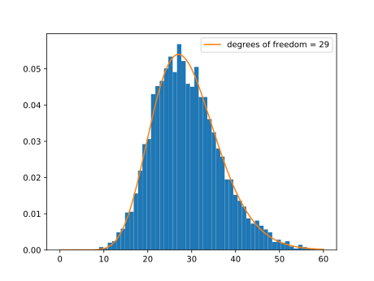
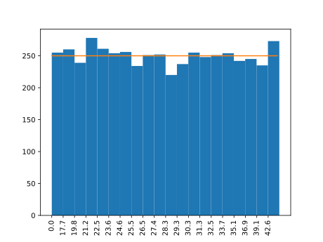

# crypto senior sem
### From cryptography to cryptocurrencies

This course is about the state-of-the-art in modern cryptography, which
finds application as the primary mathematical apparatus that has of late been
artfully fashioned into cryptocurrencies.  Cryptography is of course pervasive and
ubiquitous in the technological age, so that this course is ultimately about
certain cutting-edge information-theoretic advancements that are reshaping our
world.  In addition to cryptographic primitives, their prevailing applications
and underlying mathematics, topics include applications of zero-knowledge proofs
and their role in present-day FinTech.

Important: as far as speculating in cryptocurrencies, we think that you are likely
better off not doing so. Whether or not you take that advice, you might
do well to look under the hood of the new-fangled tech that is built atop a rather
striking assemblage of pure and applied Math and CS.

### Contents
I. [Preliminaries](#i-preliminaries)
   * [The integers modululo n](#the-integers-modulo-n)
   * [Pseudo-random sequences](#pseudo-random-sequences)
   * [Cryptographic security](#cryptographic-security)

II. [Numero-algebraic practicalities](#ii-numero-algebraic-practicalities)
   * [Prime fields](#prime-fields)
   * [Generating primes](#generating-primes)
   * [Euler's totient function](#eulers-totient-function)
   * [Plain RSA](#plain-rsa)
     * [Fermat-factoring attack](#fermat-factoring-attack)
   * [Pseudo-random bit generation](#pseudo-random-bit-generation)
     * [Blum Blum Shub](#blum-blum-shub)
   * [Algebraic formulation of RSA](#algebraic-formulation-of-rsa)
   * [More attacks](#more-attacks)
   * [Toward semantic security](#toward-semantic-security)

## I. Preliminaries

### Getting started

* First, install [polylib](https://github.com/sj-simmons/polylib),
* then install [numlib](https://github.com/sj-simmons/numlib),
* then read on.

### The integers modulo n

Let  be a fixed positive integer. We say that integers  and 
are *congruent* modulo  if  divides their difference,  and we write
 For instance, 

One can consider the
[ring](https://en.wikipedia.org/wiki/Ring_(mathematics)) of integers modulo 
denoted  or, more succinctly, 
Congruence modulo a given  defines an
[equivalence relation](https://en.wikipedia.org/wiki/Equivalence_relation)
on the integers and, as a set,  consists precisely of the resulting
equivalence classes.

An equivalence relation partitions a set into disjoint subsets. For instance,
 consists of the 6 equivalence classes 
where, for example,

<p align="center"></p>

Congruence modulo  is more than just an equivalence relation. The familiar
algebraic (ring) structure of the integers consistently descends to equivalence
classes; e.g.,  and  in
 Notationally, we usually drop the square brackets and write,
for example, ; or we might write simply  if it
is already clear that we are working in 

In Python, one can use the percent-sign operator to work modulo :
```pycon
>>> 123 % 45
33
```
Alternatively, one can use numlib to work in  as follows.
```pycon
>>> import numlib as nl
>>> R = nl.Zmod(45)
>>> R
Z/45
>>> R(123)
33 + <45>
```
Here  is the equivalence class 
(which is in fact an [ideal](https://en.wikipedia.org/wiki/Ideal_(ring_theory))
in the ring of integers) so that the notation  reminds us
that we are working modulo  (or, more abstract algebraically, modulo the ideal
generated by ).

Technical note: numlib conveniently coerces types, for instance:
```pycon
>>> x = R(123)
>>> 67 * x + 89  # no need to write R(67) * x + R(89)
5 + <45>
```

### Pseudo-random sequences

As a simple application, let us implement a
[Linear Congruence Generator](https://en.wikipedia.org/wiki/Linear_congruential_generator).
*Linear congruence* here means that we generate the next "random" output
by applying a linear function to the current state and taking the result modulo
some fixed large number, , called the modulus.  It doesn't matter as much in Python3,
but for C or say Rust, it makes good sense to mod by the large number 
Here is some code that implements an LCG using numlib:

```python
#lcg.py
import numlib as nl

# set the modulus
m = 2**64
R = nl.Zmod(m)  # R is now the ring of integers modulo 2^64

# set parameters of the linear congruence generator including initial state:
a = 123456789
c = R(12121212121) # an element of R
state = 10**10+1

def prng():
    """Return the next sequential integer between 0 and m-1, inclusive."""
    global state
    state = int(a*state+c) # a*state+c is an element of R = Z/m
    return state
```
Copy the code block above to a file called **lcg.py**.  Then the following program,
when run in the same directory, prints five "randomly" generated numbers.
```python
from lcg import prng

for _ in range(5):
    print(prng())

#1234567902244668910
#8826425326919980895
#10890877254142952100
#15231402302547497037
#10264820975732655146
```
If you want to use a different seed, then you could do something like this:
```python
import lcg

lcg.state = 1728  # put any integer here

for _ in range(5):
    print(lcg.prng())

#225454543513
#9387149945987420262
#9368084995109636919
#5613612028674063196
#4053038556501675877
```
One can think of the above LCG implementation as generating a pseudo-random
*sequence* of numbers.  When the initial seed is 10000000001, the
determinism is exhibited rather explicitly in the first number of the output.
Of course, the next number is always completely determined by the current state.

The quality of "randomness" in the sequence generated by an LCG such as the one
above, or any PRNG, is a bit subtle to assess.  A battery of tests is often deployed
when trying to detect bad PRNGs.

Since there are only  possible outputs, the period of our pseudo-random number
generator **prng** is at most 

Important: the PRNG above is *not* a CSPRNG &mdash; a
*cryptographically secure* pseudo random number generator &mdash; hence it is not
of suitable quality for cryptographic applications. More on CSPRNGs later.

In fact, the PRNG defined above may not even have the largest possible period
(which is the modulus  in general and  for our PRNG). Any positive  resulting
in  for some  leads obviously to the sequence repeating. The
smallest such  is the *period* &mdash; the length of the smallest *cycle* of numbers
which our pseudo-random sequence repeats.

Iterating the definition , one arrives at the more general
formula for  in terms of 

<p align="center"></p>

where we have assumed that  since otherwise each term in our sequence
differs, modulo  from the previous term by simply 

If  and  are not relatively prime, say  then, modulo , 
is always a multiple of . Since adding  just shifts those numbers, larger
values of  result in a smaller periods for our LCG.  We don't want a small period
so we generally pick  and  relatively prime.

In fact, since  is a power of  in our LCG, were  even,
then the expression above for  would specialize to

<p align="center"></p>

If , then the first term on the right vanishes and the constant term stops
depending on ; hence our sequence degenerates to a constant sequence &mdash;
pretty much the worst thing that can happen to one's PRNG.

If  and  are indeed, as is generally preferable, relatively prime, then 
is invertible modulo  so that  determines  explicitly, we
have  In this case, the first repeated value,
call it , in our sequence has to be equal to  (the initial state of our LCG)
since if the first repeated value were equal to  with  then necessarily
, violating that fact  is the
index of the first repeated value.

For our LCG,  is a power of 2 and  is odd; hence the first repeated value
is the initial state .  The question is whether that value recurs before
the th term in our sequence (which is not what we want).

One can guarantee that the period of an LCG is in fact as large as possible using
the Hull-Dobell Theorem; i.e., by ensuring that

*  and  are relatively prime,
*  is divisible by all prime factors of , and
*  is divisible by 4 if  is divisible by .

For a proof that the three bullet points guarantee the maximum period
see [Knuth](#references1) pp. 17-19.

If the second bullet point is satisfied then there exists a least power, , called
the *potency* of the LCG, such that  If the potency is
low then successive terms of our pseudo-random sequence change too simply and hence
not very randomly.  A potency of 2, for instance, implies that the difference between
st and the th state of our PRNG is always 
Generally, a potency of at least 5 is necessary (but not sufficient) for randomness
(see [Knuth](#references1) pp. 24-25).

#### Exercises
1. Does the LCG defined by the program above satisfy all three bulleted conditions so that its period is , the largest possible? :heavy_check_mark: **We talked through this in class.**

2. If possible, compute the potency of the LCG above to see if it even has a chance
   of being sufficiently "random". :heavy_check_mark: **Marina did this and told us the answer in class.**

3. Show the following (we used this above):  if  then, modulo , for any integer , we have that  is always a multiple of .

4. In the previous discussion we used the fact that if  and  are relatively prime, then  has a multiplicative inverse modulo ; that is, there exists  such that . Above we only needed its existence but what is  if  and  :heavy_check_mark: **Simmons did this in class with numlib's Zmod (which essentially just calls numlib's xgcd).**

Notes:
* In addition to **Zmod** (introduced above), numlib functions such as **gcd**,
  **xgcd**, **factor**, **isprime** may be helpful for some of the exercises. To get
  help on a function and see example usage, start the Python interpreter and
  **import numlib as nl**, and then issue a command such as **help(nl.xgcd)**.
  To see all objects defined in numlib, type **nl.** and hit the TAB key twice.
* If speed is of the essence, replace **lcg.py** with the following. (This is functionally
  equivalent but a little over twice as fast without the overhead of numlib.)
  ```python
  m = 2**64
  a = 123456789
  c = 12121212121
  state = 10**10+1

  def prng():
      """Return the next sequential integer between 0 and m-1, inclusive."""
      global state
      state = (a * state + c) % m
      return state
  ```

A common initial test to gauge whether a given PRNG is *not* worthy of the term
"random" employs the
[Chi-squared distribution](https://en.wikipedia.org/wiki/Chi-squared_distribution),
and works as follows.

Suppose that we partition the possible outputs into a small number of *cells* (or
*bins*). We can then use the LCG to generate a large sample of values and tally
how many land in each bin.

```python
from lcg import prng

sample_size = 12000
bins = 30

# let us split the sampled random numbers into equal bins
sample = [prng()//(2**64//bins) for _ in range(sample_size)]

def get_frequencies():
    """return the list of frequencies for successive bins"""
    frequencies = dict()
    for bin_ in sample:
        frequencies[bin_] = frequencies.get(bin_, 0) + 1
    return list(frequencies.values())

print(*get_frequencies())
```
The output is
```python
410 401 448 376 398 388 399 408 410 371 402 395 388 412 389 422 410 406 412 398 404 404 395 364 408 390 416 369 420 387
```
The generated numbers appear to be fairly evenly distributed
across the 30 bins so that our PRNG appears to sample *uniformly*.  On the
other hand, note that we should be concerned if each bin contained exactly the
same number (400) of sample values; we wouldn't expect that even from an
actual (uniform) random number generator.

One way to analyze whether we have enough, but not too much, variation in
the frequencies is to compute the test statistic

<p align="center"></p>

where  is the observed frequency of values falling in the th bin.
For a legitimate PRNG, this statistic follows a chi-square distribution with
degrees of freedom equal to one less than the number of bins.

The sampling distribution (over 5000 samples) for the 
statistic for our PRNG looks like this (superimposed with the  distribution
with appropriate degrees of freedom):

<p align="center">
  
</p>

(The program [chisq_hist.py](https://github.com/sj-simmons/crypto/blob/main/chisq_hist.py)
generates and displays the histogram above.)

Were the sampling distribution to precisely follow the  distribution,
then the lower 5 percent of values would fall in the interval , the
second lowest 5 percent in , and so on.  An easy way to get these
values in Python is to install [scipy](https://scipy.org/) and use it as follows.

```python
from scipy import stats
percentiles = [round(.05*n, 2) for n in range(20)] # [0.0, 0.05, 0.1, 0.15, ..., 1.0]
[round(stats.chi2.ppf(x, df = 29), 2) for x in percentiles]
# [0.0, 17.71, 19.77, 21.25, 22.48, 23.57, 24.58, 25.54, ..., 42.56, inf]
```

The quality of one's PRNG comes into question if the bottom or top 5 percent
of the sampling distribution is too heavy (since then the corresponding
hypothesis tests would provide evidence of non-randomness); likewise, one
becomes *somewhat* concerned if the bottom or top 10 percent is too heavy (see
[Knuth](#references1) pg. 47).

Drawing a sample, computing the test statistic above, and interpreting that
(along the lines of the previous paragraph) in the context of say a hypothesis test
would be considered a *local* test in the sense that are sample usually does not include
all of the random numbers spit out by our PRNG  &mdash; even though one should always
use a fairly large sample size for a chi-squared test.

We can bump this up to more of a *global* test if we take say 5000 samples
(each still with sample size of 12000).
Here is the relevant bar chart for our LCG where the expected frequency for
each interval is 250.

<p align="center">
  
</p>

The raw frequencies are

```python
255 260 239 278 261 254 256 234 251 252 220 237 255 248 251 254 242 245 235 273
```
which we can use to perform the so-called *chi-squared on chi-squared* test, the
idea being to check if those latest frequencies are more-or-less what they should be.
The degrees of freedom for the  distribution appropriate for our chi-squared
on chi-squared test is 

The test statistic is . The area to the right under the  distribution
with df=9 is . Hence, in a right-tailed hypothesis test with a 10% cutoff, we
fail to reject the null hypothesis that our LCG (globally) generates random numbers.

#### ~~Exercises~~ Projects
5. The histogram and analysis above look pretty good but the original sampling was always split into 30 bins. Conduct the same sort of  analysis but use different (smallish) numbers of bins and varying (large) sample sizes.

6. Replace our LCG with a Python's random number generator and compare.
     The following might be helpful.
     ``` python
     import random
     def prng():
         return random.randint(0, 2**64-1)
     ```

The [spectral test](https://en.wikipedia.org/wiki/Spectral_test) is the test
most likely to uncover weakness in a LCG. For this test, we first
use the LCG to successively generate points in 2-space:
 where  is the pseudo-random
sequence kicked out by our LCG.  Here we have tacitly divided each  by  so
that the 2D points in fact lie in the unit square 

Due to periodicity, only a finite number of distinct points will be
produced; hence, all the points can be captured by a set of parallel lines.
The maximum distance between the lines, over all arrangements of such sets of
lines, is the number in which we are interested, call it .

In fact, we want to bump up the scheme outlined above to higher dimensions;
that is, we want to compute the maximum distance, , between parallel planes
over all arrangements in 3-space that capture all of
, and so on up to the maximum
distance, , between 6-dimensional parallel hyperplanes that capture all points
constructed from our sequence in 7-space.

The maximum distances  will all be positive since
our LCG is periodic so that each set of parallel planes need only capture
a finite number of points. Also, the distances  necessarily increase with the
dimension   Heuristically, this is due to the fact that  more-or-less
evenly distributed points in, for instance, 3-space are necessarily more spread
out than  such points in 2-space.

The idea behind the spectral test is that, were the coordinates of the points drawn
from a truly random sequence of numbers in  the numbers 
would each still of course be positive due to finite machine precision, but they would
not increase with .

Returning to the case in which the  are generated by our LCG, we wish to
compute the distances  and see if they are sufficiently close to zero. Since
our LCG is based on a linear function, we are naturally led to consider
a lattice of points in -space ([Knuth](#references1) pp. 96-98).  And when
considering families of parallel hyperplanes that capture all points, we can assume
that neighboring hyperplanes are separated by a fixed distance which is of course
the desired .

[Knuth](#references1) and other authors consider the *accuracy*, defined
by  (The quantity  arises naturally in the sense that it
is the vector of minimal length in the dual of the lattice mentioned above;
cf. [Steele, Vigna](#references1) pp. 3-4.)

If  and , then the accuracy  admits
a concise characterization:

<p align="center"></p>

where the minimum is over all non-zero vectors with integer coefficients.

However, if  is large, then even  can be difficult to brute-force compute.
[Knuth](#references1) (pg. 102) gives the following 3-step algorithm to
compute  (the algorithm for   is more involved):

1. Initialize variables  and  as follows. Set     
2. Next, set     If  then set      and repeat step 2; otherwise, go to step 3.
3. Set    If  then set  Output 

How are the numbers  used to determine which LCG perform best? We want the 
 to be small, though they will necessarily increase with  even
if for good performing LCGs. Since  we want the  to be large.
[Knuth](#references1) (pg. 105) gives the following rule of thumb: 

#### Exercises
7. Show that  for all .
8. Implement the algorithm above and use it to compute the accuracy  for our LCG (for which  and ). :heavy_check_mark: **Laura did this and told us the answer in class.**

Now, since  is so large, many smallish choices of the multiplier  immediately
determine   In fact, according to [Steele, Vigna](#references1), Proposition 1,
for a full period LCG with modulus  and multiplier , one has 
whenever  and this is true for all .

For large , [Knuth](#references1) (on page 105) proposes another quantity
called the *merit*,

<p align="center"></p>

where, if  is odd, 

The merit  is the volume of a certain ellipsoid (called a *figure of merit*)
in -space:

<p align="center"></p>

If  is small, say , then  is not a good
multiplier because said ellipsoid is unlikely to capture points corresponding
to random numbers generated by our LCG.  If  or, better, ,
then  is a good multiplier. (Note: it turns out that Knuth's condition
 is essentially the requirement that the LCG's lattice behaves
like a random -dimensional lattice in that,  up to scaling,  is the
expected length of the shortest vector in a random -dimensional lattice. See
the discussion
[here](https://crypto.stackexchange.com/questions/97844/average-spectral-score-of-multiplier-in-lcg).)

The advantage of looking at  instead of just  is that  can
be used to compare different multipliers for a fixed   For instance, with
 fixed at , we wish to find a multiplier  with not only 
but also  sufficiently large relative to other multipliers.

#### Exercises
9. Compute  for our LCG; i.e.,   Is  a good multiplier based on ?
10. What if we leave the modulus at  but take the multiplier to be  214319739410341? Is this  a good multiplier? (This multiplier is recommended in [Steele, Vigna](#references1) on pg. 18.)
11. :zap:**Challenge**:zap: When  and  214319739410341, find  for  by either directly implementing the algorithm in [Knuth](#references1) or by comparing
with the definitions and listed values in [Steele, Vigna](#references1).
Also compute  for  What do those gauges say about the randomness of our LCG?
12. (Optional) [Steele, Vigna](#references1) recommends the smaller multiplier  (where still ; hence, let us assume that that value for  leads to good performance on all spectral tests. But show that it rejected by the chi-square on chi-square test above. :heavy_check_mark: **Simmons did this in class.**

In addition to the chi-squared and spectral tests, there are several other
commonly applied tests to assess the performance of an LCG or, more generally,
a PRNG.  The *Kolmogorov-Smirnov* test works well with small sample sizes and therefore
applies locally but perhaps not globally (to the entire cycle of ones PRNG) &mdash;
unless one uses a *Kolmogorov-Smirnov on Kolmogorov-Smirnov* test.

Similarly global tests may not apply locally.  The spectral test (discussed above)
looks at the complete cycle and hence applies globally, but that alone has nothing
to do with non-randomness.  In our case the complete cycle as a set is just the
numbers from  to 
In the spectral test the *order* of the numbers determines the location of the points
in 2-, 3-, 4-dimensional, etc., space.  (If we did a spectral test in 1-space, we would
get simply )

In modern times, researchers might perform a deeper analysis by applying a spectral
test to sequences with lag  &mdash; for an LCG where the lag is
, one would apply the spectral test to, for instance, points in 3-space that
look like 

The spectral test is a *theoretical* test in the sense that we has an algorithm
for computing  and  before even implementing the actual PRNG.  Meanwhile,
the chi-squared and Kolmogorov-Smirnov test are *empirical* in that we first implement
the our LCG and perform statistical test on samples drawn from it.

### Cryptographic security

The discussion and exercises above did not turn up evidence of non-randomness for the
following LCG.

```python
m = 2**64
a = 214319739410341
c = 12121212121
state = 10**10+1

def prng():
    """Return the next sequential integer between 0 and m-1, inclusive."""
    global state
    state = (a * state + c) % m
    return state
```
The LCG above is still, at least, a candidate for a viable PRNG (Pseudo-random number
generator) though several additional tests would need to be applied to bar against
non-randomness. But what does pseudo-random really mean?

In Computational Complexity Theory, a distribution is *pseudo-random* against a class of
*adversaries* if no adversary (think of an adversary as an algorithm or a test or some
other *distinguisher* or *observer*) from the class can distinguish it (with not
insignificant advantage) from the uniform distribution.

That certain adversaries cannot distinguish a pseudo-random distribution from a
uniform distribution corresponds to our intuitive notion that pseudo-random numbers
should *look like* random numbers.
A PRNG is a deterministic algorithm whose generated sequence appears to be pseudo-random
based on whichever statistical tests (e.g., the spectral test) are appropriate given
the application at hand.

The difference, in the context of complexity-based modern *cryptography*, is that the
generated numbers *must* be indistinguishable from random numbers for *all* adversaries, even
adversaries with advanced computational capabilities; said differently, random numbers
in cryptography are numbers whose value cannot be predicted before they are
generated, even with knowledge of previously generated numbers.

More mathematically, if random numbers are to be drawn from a set with  elements
(such as ), the requirement is that an adversary cannot predict the number
with likelihood non-negligibly greater than  &mdash; the same as guessing.

Equivalently, one can reformulate this as: given  consecutive random numbers from
our sequence, any observer given  of them cannot predict th one with likelihood
significantly greater than 

Our LCG fails spectacularly to be cryptographically secure, as does any LCG whose
whose modulus is a power of 2 since its lower bits are easily seen to be predictable.
We will now work out.the details for those special moduli. Importantly, *any*
LCG is predictable in that, a partial sequence of the output can be used to
generate the rest of the sequence, even without explicit knowledge of , , and 

Let  divide that modulus  of an LCG defined by
 and set 
Now, for some integer , we have

<p align="center"></p>

so that, modulo ,

<p align="center"></p>

In other words, if  divides , then when we reduce modulo , in turn, each of the
numbers  we get another LCG  but with modulus
 &mdash; which, as such, can't have period greater than 

The LCG we constructed above has modulus  Taking say  corresponds
to looking only at the least significant 4 bits of the numbers 
The sequence of those least significant 4 bits cannot be very random because its
period is at most 16.

Or just take   Reducing modulo  any LCG that has modulus a power of 2 and
both  and  odd we get   Hence, the least significant bit
always alternates, and the terms of our original sequence  are,
alternatively, even and odd.

#### Exercise
13. Suppose we use our LCG to generate two consecutive numbers, and that you are given only one of them. Based solely on that value (suppose that you forgot , , and , other than that  and  are odd and  is a power of 2), can you predict the other with probability of success greater then  (I.e., better than guessing?) If so, with what likelihood? :heavy_check_mark: **Marina and Alvaro saw in class what to do here, and Simmons later sent an email about it.**

In modern cryptography, one assumes that adversaries know which methodology is
begin employed. The point is to develop tools in which say a *key* or maybe the
initial state of a PRNG must be kept secret but not the method and its theoretical
justification.  (But even the initial state of an LCG could potentially be uncovered
given partial output.)

To be clear, an LCG should *never* be used when a CSPRNG &mdash;  a cryptographically
secure pseudo-random number generator &mdash; is required.  Moreover, passing some
battery of statistical test is necessary but not sufficient for cryptographic
security. If your PRNG does not at least appear to be random, then it has no chance
whatever of being cryptographically secure.

LCGs are not appropriate for cryptographic applications, they are however useful in
that they are simple to implement and easy to understand so that they may be
of use in say embedded systems, or in simulations, or in applications where some
not necessarily robust stochasticity is needed.

Suppose one has an application in mind for which an LCG is appropriate. Often
the situation with the lower bits not being random is not an issue.  If it is
an issue, then there are fixes.
One fix is to lop off the lower bits, after maybe first increasing the power of 2
defining  &mdash; the idea being that the most significant bits should still be random.

#### Exercise
14. Another fix is to change the modulus to a prime or, in our case, to say  which factors as . Change (only) the modulus in our LCG and print out say the first 100 numbers, each taken modulo 2.  Of course, we now have a tertiary problem.  Print out the first 100 numbers, each taken modulo 3. (Note: changing the modulus could potentially break full periodicity and favorable performance on tests, everything would have to be rechecked.)

See also [permuted congruential generators](https://en.wikipedia.org/wiki/Permuted_congruential_generator).

Lastly, are there any cryptographically secure PRNGs? Answer: yes. We'll look
at one below whose security is based on number theoretical considerations
(see [Blum Blum Shub](#blum-blum-shub)).

<a id="references1">

#### References

* Donald Knuth, The Art of Computer Programming, 3rd Edition,
  Volume 2: Seminumerical Algorithms, 1998.
* Guy Steele and Sebastian Vigna, Computationally Easy, Spectrally Good
  Multipliers for Congruential Pseudo-Random Number Generators.
  [arxiv.org/abs/2001.05304](https://arxiv.org/abs/2001.05304), 2021.

<p align="right">  <a href="#contents"> contents </a> </p>

## II. Numero-algebraic practicalities

### Prime fields

Note that  modulo 21 so that 2 has 11 as its multiplicative inverse in
  Meanwhile, in  3 can have no multiplicative inverse
since it is a zero divisor: 

A commutative ring (such as ) for which every non-zero element has a
multiplicative inverse is called a *field*.

#### Exercises
1. Show that  is a field if and only if  is prime.
2. Show that multiplicative inverses in  (or any ring) are unique.

If an element of a ring admits a multiplicative inverse, it is called a *unit*.
The units in a ring form a multiplicative group.

The multiplicative group of units in  is often denoted 

#### Exercise

3. How does the order of the group  depend on 

Above we used the numlib function **Zmod** to create a class representing 
where  may or may not be prime.  We often want to work in a prime field so we pick 
to be a prime, .  Then, it is best to go ahead tell that to numlib, by using **Zmodp**
instead of **Zmod** (because the resulting class is then faster and has more functionality).

Here is an example.

```pycon
>>> import numlib as nl
>>> PF = nl.Zmodp(2027)  # Note: 2027 is prime
>>> PF  # Z/2027
>>> x = PF(100)
>>> x   # 100 + <2027>
>>> x**1000  # 2022 + <2027>
>>> x**-1  # 750 + <2027>
```

### Generating primes

We will need some fairly large prime numbers &mdash; 200 bits, say, for now; so primes of size
around 

One way to generate such a prime would be to iterate through numbers larger that  until we
find one that is prime.  Alternatively, one could randomly generate sequences of zeros and ones of
length 200 and check if the corresponding decimal number is prime.  Python has a built-in function that
generates an integer from random bits:

```python
import random
decimal = random.getrandbits(200)
```
Of course, depending on whether the most significant random bit is zero or one, we might get a
number somewhat less than  so let us set the most significant bit to one and, while
we are at it, set also the least significant bit to 1 since primes beyond 2 must be odd:
```python
decimal |= (1 << numbits - 1) | 1
```
The variable **decimal** is now an integer whose binary representation has length 200 and both begins
and ends with 1; i.e., **decimal** is a random (depending on the robustness of **getrandbits**)
odd integer between  and 

Beyond using the fact that a prime larger than 2 must be odd, there are various other quick ways
to test whether a candidate large, odd integer  is *likely* prime.  These include
[Fermat's primality test](https://en.wikipedia.org/wiki/Fermat_primality_test) which checks to see
if  *acts like* a prime: namely, whether  for  equal,
in turn, to say 2, 3, and 5, as would be the case, by Fermat's Little Theorem (see below), if 
were in fact prime.

Rather than implement Fermat's and related primality tests yourself to detect whether **decimal** is prime,
feel free to use [numlib](https://github.com/sj-simmons/numlib)'s implementation:

```python
import numlib
numlib.isprime(decimal) # True or False according to whether decimal is prime
```
#### Exercise
4. Replace the  above with say  and write a function, using the scheme outlined above, that returns a -bit prime.

At issue is the fact that larger primes are harder to find. The difficulty is gauged by the Prime
Number Theorem.  If we define  to be the number of primes less than or equal to , then
the theorem states that  is well-approximated by  in the sense that
<p align="center"></p>

The Prime Number Theorem implies that the number of primes between  and 
is approximately

<p align="center"></p>

hence, the probability of a randomly chosen number between  and  being
prime is approximately   But since your
program from the last exercise doesn't bother with even numbers, a given candidate **decimal**
has a likelihood of about  of being prime.
It is an basic fact from probability theory (see e.g., section 2.1 of
[Simmons' primer on random variables](https://github.com/sj-simmons/probthry/blob/main/primer.pdf)) that,
on average, one expects to test about  numbers before turning up one that is
indeed prime.

#### Exercise
5. Write a program that verifies that the expected number of tries before your prime generating function returns a 200-bit prime is about 

Note: since  is small, the variance here is very large so that the time it takes for your
program to find a single prime can vary greatly; said variance is  so that
the standard deviation of the number of tries before finding a 200 bit prime is about  (The
standard deviation is  which is approximately  for small 

#### Exercises
6. Estimate the probability that two uniformly chosen -bit primes are equal.
7. What is the expected number of tries and the associated standard deviation when finding a 2048-bit
    prime.
8. (Optional) Write a program that displays the sampling distribution for the number of tries before finding a prime using the method outlined above. The mean and standard deviation should both be about 

### Euler's totient function

The following is a basic result in elementary number theory.

**Fermat's Little Theorem**:  If  is a prime and  is an integer not divisible by , then .

For those who know a little group theory this follows immediately from the fact that the order of
any element of a finite group must divide the order of the group. Here, the relevant group is
 the multiplicative group of units in 
which has order 

If you are not familiar with basic group theory, then see for example
[this wikipedia page](https://en.wikipedia.org/wiki/Proofs_of_Fermat%27s_little_theorem)
for various other proofs of Fermat's Little Theorem.

#### Exercise
9. Use your program above to generate a 200-bit prime  and then verify that  where  is, say, 1234567, or any positive integer less than . Note: you may wish to use Python's built-in [pow() function](https://docs.python.org/3/library/functions.html#pow).

Below we will need the following generalization of Fermat's Little Theorem.

**Euler's Theorem**:  If  is positive integer and  is an integer relatively prime to ,
then 

Here  is Euler's totient function which returns the number of positive integers less than
and relatively prime to 

Notice that Euler's Theorem specializes to Fermat's Little Theorem if  is prime since, then,
  Moreover, Euler's Theorem also follows from basic group theory where the ambient
group is , the multiplicative group of units in ,
which has order 

An *arithmetic* (i.e., defined on positive integers) function   is *multiplicative*
if  whenever  and  are relatively prime. For instance, Euler's totient function,
, is multiplicative &mdash; a fact which we will fairly easily establish using, yet again,
elementary group theory.

We noted above that the order of an element of a finite group necessarily divides the order of the
group.  For cyclic groups, this situation is particularly nice.  Let  be a cyclic group of order
 (feel free to think , to which  is necessarily isomorphic). Let us show that
for any divisor  of , there are  elements of  with order 

If  is a generator for  then,  must have order   So that's
one element of order   To get all elements of order , consider elements of  of the
form  for positive integers  Plainly, 
where  is the identity element in  But, in general, the order of  could be less
than .  That happens precisely when  since, then,
 so that  has order dividing 
Hence, there are exactly  elements of  of order  namely,  where
 and 

Applying the proceeding discussion in a special case: notice that  has 
generators; namely, the elements  that are relatively prime to  as integers.

Let us also note down that if  is a generator of a group  of order , and  is an integer
satisfying  then  necessarily divides . To see this, first recall that, by the
definition of *order*,  is the *least* positive integer satisfying  Then use the
division algorithm to write  for some integers  and  with . We have
 If follows immediately that  since otherwise  is
a positive integer less than  satisfying 

Now, to see that  is multiplicative, let  and  be cyclic groups of order 
and , respectively, and let  and  be, respectively, generators for  and . Consider
the product .  We claim that, if  and  are relatively prime, then  is a
cyclic group of order  Note that

<p align="center"></p>

Hence, whatever the order of , call it , we must have that it divides 
To prove our claim, we must show that  divides , so that 
Looking at just the first component of , we see that 
divides ; similarly, looking at only the second component,  divides . But then 
must divide  since  and  are relatively prime.

Finally, we show that  is multiplicative.

**Proof that Euler's totient function is multiplicative**. Under our assumtions, the product group
 has order   It's also cyclic (since  and  are relatively prime). Therefore,
the number of generators of  is .  On the other hand,  is a generator
if and only if  and  generate, respectively,  and .  But  has  generators
and  has , so that  :black_medium_square:

#### Exercises
10. Let  be a product of distinct primes. Show that 

11. Show that for  prime and  a positive integer, we have  Hint: this is just a counting argument. Which positive integers less than  are *not* relatively prime with 

By the Fundamental Theorem of Arithmetic, any positive integer  can be
written (uniquely, up to order) as a product of (positive powers of) distinct primes:
;  hence,

<p align="center"></p>

While showing, above, that  is multiplicative, we proved:

**Proposition**. If positive integers  and  are relatively prime, then  as rings. Moreover, 
as multiplicative groups.

**Proof**. Arguing as above, except additively, the map , where  generates
, is necessarily an isomorphism of additive groups that one easily checks is also a ring homomorphism (that, then, restricts to an isomorphism of multiplicative groups). :black_medium_square:

More generally, one has the [Chinese Remainder Theorem](https://en.wikipedia.org/wiki/Multiplicative_group_of_integers_modulo_n#General_composite_numbers).

### Plain RSA

:warning: *Plain*, or so-called *textbook*, RSA is inherently and dangerously insecure for
real-world cryptographical applications; nonetheless, it is an accessible illustration of the
fundamental *trap-door* mechanism in modern cryptography. And, it can be enhanced and made into
a secure public-key cryptosystem, as we will see.

In modern times, you can create and publish (on, say, your personal webpage) a *public key* that can
then be used (by someone called, say, Athena) to encrypt a private message to you.  Only you can
decrypt Athena's encrypted message, so it doesn't matter if a bad actor sees Athena's encrypted
message that she is sending to you.

#### How to set up your keys

Important: since your enciphering key is public, a bad actor might try to intercept Athena's
encrypted message and modify or replace it with a malicious message encrypted with your public key. Then you
decrypt the bad actor's message thinking that it is from Athena.  We need to bar against this
weakness but, for now, let us ignore it.

To create your public key in the
[RSA cryptosystem](https://en.wikipedia.org/wiki/RSA_(cryptosystem)),
you first choose two large primes  and  (which you will keep
secret) and multiply them together obtaining .  You also choose a
positive integer  that is relative prime to .
Your *public key* then consists of the pair of numbers 

In order to, in the future, decrypt messages that were encrypted using
your public key, you go ahead and invert  modulo  that is,
you find the least positive integer  that satisfies
 Then  is your decryption key
*which you must keep secret*.

At this stage, you can actually delete, forget, and/or erase both  and
.  But keep  and keep  secret always.

Now suppose that  is a positive integer representing the *plaintext*
message that Athena wants to encrypt and send to you.  Athena encrypts 
producing another integer  called the *ciphertext* as follows:

<p align="center"></p>

Athena can then send the ciphertext  to you or, say, publish it on her
webpage. Short of discovering an efficient way to factor products of large primes
and assuming that you didn't leak ,  or , then you are the
only person on the planet who can decrypt  back into the plaintext 

#### How to decrypt

Now, how do you decrypt Athena's encrypted message   Answer: you simply
compute  which is actually  the original message. To
show this, we claim that, for any integer 

<p align="center"></p>

since, then,  as desired.

**Proof of claim**. First assume that  is relatively prime to  Then

<p align="center"></p>

where  is an integer satisfying  and we have used
the fact that, by Euler's Theorem,  whenever  is relatively
prime to 

If  is not relatively prime to  then either  divides  or  divides
 or both  and  divide   In the latter case, since  and  are distinct
primes,  must be a multiple of 
and so  since, modulo , both  and  are zero.

Assume without loss of generality that , but not , divides  Then, clearly
 divides  Also, by Fermat's Little Theorem,  since
 doesn't divide  Hence, similarly to above,

<p align="center"></p>

so that, also,  divides  Now, since  and  are distinct primes, each
of which divide  it must be the case that  divides  that is,
 when  is not relatively prime 

Therefore, the equality  holds for all  since it holds when  is
relatively prime to , and also when it is not. :black_medium_square:

Note that not even Athena can decrypt her own ciphertext  since she does
not have  She only has  (and ) so she can only encrypt.

So how is it that your public key can't be reverse engineered by a bad actor?
Everyone has your encryption key  But to compute  from , one
must invert  modulo not , but modulo   And that's the rub,
computing  when , a product of large primes, is very, very time
consuming &mdash; it's essentially equivalent to factoring  into ; i.e.,
finding a divisor of .

Let us test drive the RSA scheme.

Cryptographers very often use the Fermat prime  for
their RSA encrypting exponent (partly because raising to the 65537th power mainly
consists of squarings). Then they generate primes until they
find distinct  and  that satisfy 

Suppose that you use your program above and find the following two
200-bit primes,  and :
```python
p = 1162281642500018516457695142918123385886797686236787603454999
q = 1576485350800305182150586120662765326256410287326195239351103
```
Let your public key be  where  and  is the product
of the two primes in the previous code-block.

#### Exercises
12. Verify that your key  is indeed relatively prime to  for your 

13. Suppose that Carmichael uses your private key  to encrypt a (numeric) message. What is your
decrypting exponent,  and what was the original message if the ciphertext you receive from Carmichael is:
    ```python
    1228656544646342294930925759475188964963998457780851975302427012554675014888739125369008335923675038120110871984093074455
    ```

<a id="arthurmarvin">

14. :zap:**Challenge**:zap: Marvin can't be bothered to use large primes, so his public key is  \{932311734169679424087726241879, 65537\}. Arthur sends Marvin the following encrypted very secret message. You break Marvin's encryption, and intercept and decode the following ciphertext.
    ```python
    504779851614048359547310249856
    ```
    What is Arthur's plaintext to Marvin? :medal_sports: **Marina**, **Laura**, **Alvaro**

    Can you also decrypt the following intercepted ciphertext? :medal_sports: **Laura**, **Marina**, **Alvaro**
    ```python
    538940096304536933932071588652
    ```

#### Fermat-factoring attack

This attack on RSA is in play when the two primes  and  are relatively
close together. Why is  and  being close a weakness?  First, notice that

<p align="center"></p>

Let us assume that  and  are distinct odd primes with   If we set
 and , then  and  are positive integers and the last expression
on the right in the equality above factors, so that

<p align="center"></p>

which is just   If we can efficiently find  and , then we've
effectively found  and 

If  and  are close to each other, then  is small. Looking at 
we could incrementally look for the smallest positive integer  such that  is
a perfect square (which would have to be  That would take  steps and,
each step, we'd have check whether the number  is a perfect square. Fermat's
factoring method does better.

First, notice that, if  is manageably small in the equality , then we
have that , which is bounded below by , shouldn't be hugely larger than 
Also,  so let us try to find  by starting with 
and incrementing it until  is a perfect square (which must be 
Algorithmically, one could do something like:

1. Set  and 
2. If  is a perfect square, go to step 3; otherwise set ,   and repeat step 2.
3. Return 

Notice that the discussion above doesn't use that  and  are prime, so that the algorithm
returns a factor for any product of odd (positive) integers &mdash; not just odd primes.

How many steps should this take? Consider  Solving this for , we
get

<p align="center"></p>

Looking just at the denominator in the last expression,

<p align="center"></p>

so that   If  is small relative to , then
the algorithm has a chance of completing and, in each step, we check whether a number
less than  is a perfect square.

The next exercise test-drives this attack. First, though, the following code snippets
may prove useful if you are using Python.  The issue is that an obvious way to check if
an integer  is a square is to check if its square root is an integer.  The problem is that
Python's float method **is_integer** fails for large values of , as do other obvious
methods employing floats.

To stay completely in the realm of integers, one could use a bisection method:

```python
def sqroot(n):
    """return sqrt(n) if integer n is a perfect square; otherwise, return 0"""
    assert type(n) is int and n > 0
    lower, upper = 1, n
    while lower + 1 < upper:
        middle = (lower + upper)//2
        if middle * middle < n:
            lower = middle
        else:
            upper = middle
    return lower if lower ** 2 == n else upper if upper ** 2 == n else 0
```
Similarly, taking the ceiling of the square root of a large integer fails; consider
using this instead:
```python
def ceil_sqroot(n):
    """return integer ceiling(sqrt(n)) where n is a positive integer"""
    assert type(n) is int and n > 0
    lower, upper = 1, n
    while lower + 1 < upper:
        middle = (lower + upper)//2
        if middle * middle < n:
            lower = middle
        else:
            upper = middle
    return upper
```
Note that the algorithm in each function has order 

#### ~~Exercises~~ :zap:Challenges:zap:

15. Robertson uses 512-bit primes to generate his RSA public-key.  For his encryption key , he uses  65537 and  equal to (in hex):
    ```python
    0x50886174e2215b2a1af3aa90b4856cc816f2d93732342613699c424c8b4a9e022974cf8aadd449dd8c80149f76854c61f139b4f7180acbdf49971d867809d4cb06603a3c5645295f0083b276f0f751f5bc71630d0c1c84ef65306ae9efd9820fc8bc162d07ea1ff9bf5dc4720f72dc4a6d33ffdcfc4a1f7847df61eeaa56c5bd
    ```
    Simmons encrypts a very important message and sends it to Robertson. Here is the (hex)
    ciphertext:
    ```python
    0x50886174e2215b2a1af3aa90b4856cc816f2d93732342613699c424c8b4a9e022974cf8aadd449dd8c80149f76854c61f139b4f7180acbdf49971d867809d4cb06603a3c5645295f0083b276f0f751f5bc71630d0c1c84ef65306ae9efd9820fc8bc162d07ea1ff9bf5dc4720f72dc4a6d33ffdcfc4a1f7847df61eeaa56c5bd
    ```
    You break the key and you intercept the ciphertext.  What is the plaintext?

16. How big is the difference between Robertson's  and ? E.g., what's the smallest integer  such that 

Realizing that there are many other tricks and optimizations useful when Fermat factoring (see, for
example, the [Wikipedia page](https://en.wikipedia.org/wiki/Fermat%27s_factorization_method)), let
us make some estimates based on our naive algorithm above.

Suppose that  and  are uniformly randomly and independently chosen -bit primes. What is
the likelihood that  and  are such that their product  can be factored in less than,
say, a trillion &mdash; which is about  &mdash; steps of the algorithm outlined above?

We know that the number of steps is bounded by 
which we, in turn, want bounded by  We know that ; hence

<p align="center"></p>

We are guaranteed that the number of steps is less than  if 
that is, if 

Using the Prime Number Theorem, we previously estimated the probability of a -bit number
being prime to be about   Suppose  has been chosen, We can now very roughly
estimate of the probability,  that a -bit random  satifies 

<p align="center"></p>

#### Exercise

17. If Robertson picked his  and  at random, how unlucky was he, given that he used 512-bit primes?  Asked differently, if one picks two 512-bit primes uniformly randomly, how likely is it that the resulting  is factorable using less than a trillion steps in our implementation of Fermat factoring?  What if one uses 100-bit primes? 200-bit primes?

On page 40 of the appendix of the draft standard [DSS](https://nvlpubs.nist.gov/nistpubs/FIPS/NIST.FIPS.186-5-draft.pdf) (from [NIST](https://csrc.nist.gov/publications/fips)), the requirement is   Here  is the bit-length of , so  is
our , the bit-length of each of  and  So, for 512-bit primes, they require that
 Comparing with our very rough estimates above, NIST clearly anticipates adversaries armed with state-of-the-art machinery and advanced computational skill.

### Pseudo-random bit generation

True random number generation is challenging.  Hardware-based generators that rely on
time between emissions in radioactive decay or on atmospheric noise
(see [random.org](https://www.random.org/)) use some physical source the data
from which has to be rendered bias-free and uncorrelated.  For cryptographic
applications the equipment must be tamper-proof and the generators themselves
must bar against manipulation or even observation by adversaries.

Those challenges and more await designers of software-based generators that
harness user mouse movement or, say, system load as an initial source of randomness.
Running out of such randomness, along with a host of other potential weaknesses
including timing attacks, can lead to breaches of security.  Performant software
generators mix many sources of randomness, often using a
*cryptographic hash function* (discussed later).

A theme in modern, complexity-based cryptography is that if the output of a PRNG cannot
be practically distinguished from a truly random sequence, then it *is* effectively
truly random.
To formalize this, cryptographers employ a few basic constructs.

First, a *random bit generator* is a device or algorithm that
produces a list of bits (zeros or ones) in such a way that (1) a given position's bit being a zero
or one is independent of the value of any other position's bit, and (2) in each position, the value
one and zero occur with equal likelihood.

From a random bit sequence, we could fashion a uniform random number generator that
takes values in  by collecting sequences consisting of
 bits and then
regard those as the binary representation of a decimal number (and ignore any number
that turns out to be larger than 

Next, let  denote the set of all strings of length , each character of which
is either  or 

**Definition.** A *pseudo-random bit generator* (PRBG) is a (deterministic) algorithm
that takes a truly random initial *seed* in  and outputs a
*pseudo-random bit sequence* in  where  (that is,  is
much greater than 

Notice straightaway that a PRBG has no chance of being uniformly random on 
since at most  elements of the  bit-strings in  have a chance
of being selected, the others have likelihood zero of being selected.

#### Blum Blum Shub

Similarly to the RSA public-key encryption scheme, one can implement a PRBG as follows.

Generate two distinct large primes, each congruent to 3 modulo 4. Suppose you get these 512-bit primes:
```python
p = 0x9072333555dff36dfea913a9ec05574996cd9ff582a938970d1013740291f65c80f0ea660acf6c9e8b50546732806f9ae52fa6c505de974030e713f06ab8beeb
q = 0x8dbade2d14b9602b54517e6ae519b59194b72878598530df5b021431b2bb7eeea49031fe81b0c337e851bab97956f722c22b3e562e76ace4b7fc2e75497172df
```
Calculate :
```python
0x4ff8568a0d39836d32dbf022675362b03ae6c566b8027ad9811b71cbe8c5fa37bc60188e4b915cc8de90d2c24ecba81c42f5bd601cc93c4c880ccb0539ed68c5435fc1cb83e1ddf840293eaaef32c46a3366bfd4fb907a1623c9fd5478f5b0ef749c40aebd56509b67e4b08c87d54f910f6fc8b310ce2d10c0cab35784adf4b5
```
Now, delete or keep secret  and .  Assuming that factoring products of large primes remains intractable,
the following is a cryptographically-secure pseudo-random bit generator.
```python
#blumblumshub.py
import random
import numlib

n = 0x4ff8568a0d39836d32dbf022675362b03ae6c566b8027ad9811b71cbe8c5fa37bc60188e4b915cc8de90d2c24ecba81c42f5bd601cc93c4c880ccb0539ed68c5435fc1cb83e1ddf840293eaaef32c46a3366bfd4fb907a1623c9fd5478f5b0ef749c40aebd56509b67e4b08c87d54f910f6fc8b310ce2d10c0cab35784adf4b5

state = random.randint(1,n-1)
while numlib.gcd(state, n) != 1:
    state = random.randint(1,n-1)

state = state  * state  % n

def prbg_():
    global state
    state  = state  * state  % n
    return state  % 2

def prbg(length):
    bitstring = ''
    for _ in range(length):
        bitstring += str(prbg_())
    return bitstring
```

To use this, do something like:
```pycon
>>> from blumblumshub import prbg
>>> prbg(100)
```
Example output is:
```python
1111111000101111100110111111000011011000011101111000100110001010001010011111000100010001010001001010
```
The "random" bit-string starts with 7 ones and, soon after, a run of 5 ones, then 6 ones.  Maybe
there is something wrong with our PRBG.

#### ~~Exercises~~ Projects

18. Write a program that collects, say, 10,000 zeros and ones from an instance of our Blum Blum
    Shub PRBG and tally up the total number of ones that occur.
    There likely won't be exactly 5000 ones, which is not cause for alarm, of course. How do
    we analyze this? Formulate an carry out an appropriate statistical test. How does our
    Blum Blum Shub PRBG perform?

19. Formulate and perform a statistical "runs" test which analyzes appropriately the length
    of *runs* in samples bit-strings. How did our PRBG do?

    Here a *run* refers to a substring consisting of consecutive zeros (called a *gap*) or
    of successive ones (called a *block*).


20. Apply the test above to our final LCG from before &mdash; you might want to construct
    some other LCG(s). How to do they perform?

    Note that you don't want to simply take the outputs modulo 2 on our final LCG. That
    LCG has modulus a power of 2, so the final bit just alternates (as we saw explicitly).
    But you could do something different, like output the parity of the numbers, or take
    some high-significance bit instead of the lowest.  Or you use a different modulus
    but then you'd likely want to ensure that your LCG is full period and performs well
    on other test such as the chi-squared and spectral tests, and so on.

Previously, we used Python's **randint** in our program to generate -bit primes.
Then we used that program to generate primes for our Blum Blum Shub PRBG. Now,
we could use our Blum Blum Shub PRBG to provably uniformly generate a -bit integer
as follows.
```pycon
>>> blumblumshub import prbg
>>> k = 200
>>> int(prbg(k), 2) # 1475114190501915896846876012970414686611326105418089001441857
```

Cryptographers do not often use the Blum Blum Shub PRBG in practice, for two main
(and related) reasons. First, Blum Blum Shub is in danger of being unviably slow, even when
generating a modest number of random bits; second, generating bits more efficiently
can jeopardize security.

Let us perform a quick and dirty assessment of the first issue (comparing with Python's
**randint**). Run the following from your commandline:
```bash
simmons> python3 -m timeit -s 'import random; k = 2048' 'random.randint(2**k, 2**(k+1))'
100000 loops, best of 5: 3.7 usec per loop
```
Here we are using Python's (builtin) [timeit](https://docs.python.org/3/library/timeit.html)
module. The output, on Simmons' Corei5 office machine, is shown.

Next run this:
```bash
simmons> python3 -m timeit -s 'from blumblumshub import prbg; k = 2048' 'prbg(k)'
50 loops, best of 5: 6.35 msec per loop
```
Python's **randint** is about 2000 times faster (partly due, no doubt, to C byte-code).
Now, looking back at our code, we are currently only drawing a single bit for each
call to **prbg_**.  One could try drawing more bits each pass but then one might have
to increase the size of the modulus to maintain security; each iteration,
 bits can be extracted, where  is modulus (see, for example,
[Sidorenko, Schoenmakers](#references2)).

### Algebraic formulation of RSA

Let  be the product of two large primes, and let  be relatively prime to , as
is the requirement in the RSA scheme. Then  is naturally a unit in the ring  or, to
say the same thing, an element of the group  If  is your RSA encrypting
exponent, then  is the exponent that you use to decrypt.

Let  be an element of   Then  defines a function
 with inverse  Since 
is an invertible mapping, it is a permutation of (the set) 
If  represents our plaintext message, then our ciphertext  is just the image of
 under this permutation. Moreover, decrypting our ciphertext  is just applying
the inverse permutation,  to 

### More attacks

:warning: Plain RSA is inherently insecure and admits all manner of attack; only a few are outlined below; c.f., [Boneh](#references) and some of the citations [here](https://www.researchgate.net/publication/331390347_Forty_years_of_attacks_on_the_RSA_cryptosystem_A_brief_survey).

Anyone familiar with pop culture in the 80s might have guessed the numerical plaintext message in
the Arthur-to-Marvin Challenge above, and then verified correctness by simply encrypting that number
and verifying that it matches the ciphertext. Alternatively, if an attacker guessed correctly that
the plaintext was likely a smallish number, then they could encrypt every number less that say
1,000,000 and check if they hit the ciphertext.

#### Exercise

21. Write a tiny program to mount this sort of attack and uncover the first plaintext message
    that Arthur sends to Marvin in [this problem above](#arthurmarvin). Why doesn't this method
    reveal Arthur's second message?

If  and  are small, and  is large, then an attacker might be able to decrypt  by
simply taking the non-modular  root.  More generally, an attacker who can significantly narrow
the set of possible messages could potentially mount a brute-force attack involving encrypting
a bunch of possible messages and checking for a match with the ciphertext.

The protocol would have to be modified, were the RSA scheme to even have a chance of being
equally secure for all messages.  Some flavor of *padding* (discussed below) is in order.

Thinking about the (plain) RSA setup in algebraic terms is simple and natural, but the
tight, wholly algebra structure leads to serious weakness, cryptographically.

Notice that of the   permutations of the set , only 
are of the form .  If  and  are large then this is
still a very large *key space*.  However, suppose that one is extremely unlucky
and picks  in such a way that  is small (as a positive integer less than 
Then an attacker who intercepts the ciphertext  need only compute increasing powers
, ,  until they reach
 (This is the same as trying to brute-force solve
 for  but that is not directly in play since the attacker doesn't
know 

So an attacker could eventually produce  by taking higher powers
 but how would they know when to stop?  At each step,
they could check whether  if so, then  Alternatively, they
could continually multiply  by itself, obtaining  until
they get 

If  in  then, as positive integers less than , 
hence 
Now, if  and  are fairly large k-bit primes, then  and  are 2k-bit numbers;
and, if  which is a 16-bit number, then  must be at least (2k-16)-bits.  An attacker
could start computing incremental powers  starting from 
The (uniform) likelihood of  being one of the first, say,  integers in
 is  Hence, 100-bit or larger primes should suffice to
prohibit this sort of naive attack.

The point of the previous discussion, in algebraic terms, is that, if large enough primes are
used, then the cyclic subgroup (of the permutation group of the set ) generated
by  likely has very large order. An attacker cannot simply iterate the
permutation to that order; rather,  is must be know which requires knowledge of  and 

#### Chosen-ciphertext attack

The algebraic nature of the RSA scheme leads to another flavor of attack, a
*chosen ciphertext attack*.
This exploit hinges on the fact that the map  is a monoid homomorphism
 with respect to multiplication in 
that is, 

Suppose that the attacker has intercepted  and assume that the attacker has the ability to
obtain the plaintext associated to any ciphertext (except c) chosen by them (the attacker).

#### :zap: Challenge :zap:

Harshad's RSA public-key is  where  and  is:
```python
0x799c5302bf9d09bf7b39874f23880bf5102d9f11a792c07aa822e9cd1289c198378e30eda452c88d46d6bc2f3393834c9252ff79d6cb53e876011acbb49b0ba305bbc1ce204cfb2c7c0610051c63752d9b8cd8e8a16e6b92dda67242ee8e8e62bccd87250638d9d751c565917bef78b7b929a7a9900f06ab66962776260900fd
```
Suppose that Bloem discovers a very special number, encrypts it using Harshad's public key, and sends the resulting ciphertext to Harshad.  You, of course, intercept the ciphertext, which is:
```python
0xa8713dfdd0acb832e983ad568087001493afb8de806d45dedcf8cc2f35607e3aa7bf9fed857ee35aeb3c880962dbf5491b596528908007f1c89504c03b948917704fe29eef5afe934a9bcd5e7334daa994584109d704ee8bd6d3733323d7ce14e5f7bfd63e92441206e95d8316b8c25d8093c7afc219032ef56d354830c81f2
```
22. Next, you use Harshad's public key to encrypt, say,  obtaining . Then you trick Harshad into deciphering the product  and sending the resulting plaintext to you.  If he sends you , how can you now compute Bloem's original plaintext?  What is Bloem's original plaintext?

In algebraic terms, the attacker picks any  and encrypts it using the public key  obtaining    Then the attacker somehow tricks Harshad into decrypting  where, of course, , which can then easily be used to compute  since  is invertible.

It may seem disingenuous to imagine the target of an attack cooperating with the attacker by decrypting
whatever the attacker wishes. In fact, complexity-based cryptography often assumes that an attacker
has access to an *oracle* that does exactly that &mdash; decrypt anything the attacker wishes
(besides the ciphertext  itself).  The idea is to devise protocols that can withstand even
so-called *chosen-ciphertext attacks*.

#### Malleability

An adversary intercepts a ciphertext  encoding a secret message   Suppose
that the eavesdropper gains some advantage if they can multiply the message  by 2 (or any element of


First, the eavesdropper computes  and then replaces the intercepted message  with 
and sends it along to it's final destination.  The intended receiver of the ciphertext decodes 
obtaining  instead of 

### Toward semantic security

As we saw above, Plain RSA is not secure against choosen-ciphertext attacks; worse, it is not
even secure against so-called *passive* attacks that assume that attacker has access only to
the public-key and so can only choose plaintexts and encrypt them.

For a public-key cryptosystem to be [semantically secure](https://en.wikipedia.org/wiki/Semantic_security)
it must provably bar against an attacker gaining any practical advantagous partial information
about a plaintext given only the corresponding ciphertext and the public key. The technical
definition requires *chosen-plaintext* indistinguishability which, in turn, imagines an oracle
that randomly selects from two equal-length messages submitted by an adversary, encrypts it with
a randomly selected public-key, and returns the resulting ciphertext along with the public-key
to the adversary.  The requirement is that the attacker cannot practically distinguish which
message was chosen by the oracle with probability significantly greater that 1/2.

Plain RSA immediately fails this test because it is deterministic: the attacker need
only use the public-key to encrypt two messages &mdash; 0 and 1, say &mdash; and then submit
those ciphertexts to the oracle.  The one randomly selected by the oracle can be identified
with 100% accuracy.

That is to say, Plain RSA has to be enhanced in order to have a chance of being
semantically secure which, even then, may be still be open to chosen-ciphertext attacks.
The modern solution is to use randomly-generated padding to augment messages before they
are encrypted using the public-key &mdash;
[OAEP](https://en.wikipedia.org/wiki/Optimal_asymmetric_encryption_padding)
(Optimal Asymmetric Encryption Padding) is usual method for doing this with RSA.
RSA with OAEP is non-deterministic; multiple ciphertexts corresponding to the same message
will, with extremely high-probability, be mutually distinct.

#### Encoding human-readable messages

In our plain RSA scheme, our
message has so far been some element of , which we naturally represent
with a positive integer less than  What's the standard way to implement messages
containing letters and other characters?

In RSA, the modulus  is large &mdash; 1024-bit, say.  Suppose that we
use a small *alphabet* to construct human-readable messages. For English speakers one
might minimally choose the 26 lowercase letters *a* to *z*. If we allow arbitrary messages,
using those letters, of length, say,  then we already have a problem if
 &mdash; if  &mdash; since then we
cannot *injectively* map the human-readable messages to 

If we want spaces and punctuation, we could use [ASCII](https://en.wikipedia.org/wiki/ASCII)
which is a character encoding comprising upper- and lower-case letters, single-digit decimals,
and various punctuation, along with 32 control characters that we probably don't need. There
are 95 printable characters.
All together, ASCII encodes 128 characters into 7-bit integers
(see this [chart](https://en.wikipedia.org/wiki/ASCII#/media/File:USASCII_code_chart.png)).

[PKCS #1](https://en.wikipedia.org/wiki/PKCS_1) (Public-key Cryptography Standards)
provides basic definitions and mathematical constructs underlying the RSA encryption
scheme and makes recommendations in terms of *primitives* for implementations.
Since PKCS recommends an 8-bit &mdash; so one byte, or, octet &mdash; encoding, it makes
sense to use [UTF-8](https://en.wikipedia.org/wiki/UTF-8) (which includes ASCII as its
first 128 characters).

Using an 8-bit encoding, we can encode UTF-8 messages of length 
( if  Longer messages would have to be broken up into blocks, each of which would be encrypted in turn.

PKCS #1 defines a primitive called
[OS2IP](http://mpqs.free.fr/h11300-pkcs-1v2-2-rsa-cryptography-standard-wp_EMC_Corporation_Public-Key_Cryptography_Standards_(PKCS).pdf#page=9)
(Octet String to Integer
Primitive) which takes a sequence of bytes and returns a non-negative integer.
Let us implement OS2IP in Python.

First, we convert a string holding our message to a Python
[bytes](https://docs.python.org/3/library/stdtypes.html#bytes) object.
```pycon
>>> message = b'"Information: the negative reciprocal value of probability." -- Shannon, 1948'
>>> message
b'"Information: the negative reciprocal value of probability." -- Shannon, 1948'
>>> type(message) # <class 'bytes'>
```

Note: if you want to include unicode characters beyond ASCII, then you may need to specify
UTF-8 when converting to bytes:.
```pycon
>>> message = '« Secret de deux, secret de Dieu; secret de trois, secret de tous. » -- proverbe français'.encode('utf8')
>>> message
b'\xc2\xab Secret de deux, secret de Dieu; secret de trois, secret de tous. \xc2\xbb -- proverbe fran\xc3\xa7ais'
```
A Python [bytes](https://docs.python.org/3/library/stdtypes.html#bytes) object behaves somewhat like a string:
```pycon
>>> message[0]
194
```
UTF-8 is a *variable-length* encoding (see, for example, [here](https://sethmlarson.dev/blog/utf-8));
each character is encoded using one to four octets (bytes). More frequently occurring characters
generally use less bytes.  The [left guillemet](https://unicode-table.com/en/00AB/)
uses two bytes: **C2 AB** in hex, which is **194 171** in decimal.

Let us now implement
[OS2IP](http://mpqs.free.fr/h11300-pkcs-1v2-2-rsa-cryptography-standard-wp_EMC_Corporation_Public-Key_Cryptography_Standards_(PKCS).pdf#page=9).

```python
def OS2IP(X):
    """Return the integer primitive x for the octet-string X."""
    # the sum below is the same as: int.from_bytes(X, byteorder = 'big', signed = False)
    return sum([x * 256**i for i, x in enumerate(X[::-1])])
```

The standard uses the notation  for the number of octets in the input octet string.
If  where each  represents
our octet string, then **OS2IP** maps this to the integer 
(the left-most octet determines the most significant portion of the integer).

For fixed , the map defines a bijection from the set of octet strings of length 
to the set 
The inverse mapping is called
[I20SP](http://mpqs.free.fr/h11300-pkcs-1v2-2-rsa-cryptography-standard-wp_EMC_Corporation_Public-Key_Cryptography_Standards_(PKCS).pdf#page=8):
```python
def I2OSP(x, xLen):
    """Map an integer x to an octet-string X."""
    assert x < 256**xLen, "integer too large"
    return x.to_bytes(xLen, byteorder = 'big', signed = False)
```

Test driving those two functions on the message above, we have:
```pycon
>>> m = OS2IP(message)
>>> m
274873227007013220853194865361031398209358857387795228459596366470548372698409537461728865739289920635511061986596506444387159296380925336687869159143300946529393908706703078375797190040253439843230647079564428903853418867
>>> I2OSP(m, len(message)).decode('utf8')
« Secret de deux, secret de Dieu; secret de trois, secret de tous. » -- proverbe français
```

#### Exercise

23.  The following integers were obtained by partitioning the **bytes** version of a long human-readable message into pieces and applying OS2IP to each piece in turn.  Decode the 3 integers back into a single human-readable message assuming that .
     ```python
     8148005161556551804043142199660631494681528140650822600136084998387357112108317491287436260923406505931864938073161946364938332791368570105875948573513727327591104929790537105755837082151488779548034635309275341934058978012160570568794235012357380859739572435669585019614245512029471707669863116139888
     4536349843976346312836460170468749286561964424351466747171040921929279400531580926025621971360458028850193810030292112586186499583889141942059093666096467348224496980293734851564288662520367071658728765218415511795671620978766949287934200652050299193168658544707334905806785657101906068685821747491616
     12208130087930690061449158021184773120883647178368244218281293496571934819926953
     ```

#### Padding

A short input to OS2IP results in small output, and we've already seen that small  (relative
to  can lead to weak encryption.   We want a given plaintext  to land essentially
uniformly in  regardless of specifics such length of our human-readable message.
A good approximation to uniformly distributed plaintexts can be achieved by padding our
human-readable messages in such a way that they are of more or less maximum length. Also,
if we pad with randomly generated bytes, then the same message leads to distinct plaintexts
under repeated encodings.

Let us implement the padding scheme recommended in
[PKCS #1 v2.2: RSA Cryptography Standard](http://mpqs.free.fr/h11300-pkcs-1v2-2-rsa-cryptography-standard-wp_EMC_Corporation_Public-Key_Cryptography_Standards_(PKCS).pdf#page=24).
:warning: This padding scheme bars against the exploits mentioned above but is still open to compromise.  An improved padding involving hashing is implemented below.

The function **RSAencrypt** in the following codeblock implements the encryption protocol in the
standard except that it outputs the ciphertext in the form of an integer (note that it uses the
Blum Blum Shub PRBG that we constructed above).  Likewise, the function **RSAdecrypt** takes the
ciphertext in the form of a positive integer.

```python
import math
from blumblumshub import prbg

def RSAencrypt(n, e, message):
    """Return ciphertext given an RSA key {n, e} and a message.

    Args:
        n (int): the modulus.
        e (int): the encrypting exponent.
        message (bytes): the message (as a bytestring) to encrypt.

    Returns:
        int. A non-negative integer less than n.
    """
    # the length of n in whole octets
    k = math.floor(math.log(n, 256))

    # check that message is short enough leaving room for padding
    mLen = len(message)
    if mLen > k - 11:
        raise ValueError("message too long")

    # generate a random bytes-string consisting of non-zero bytes
    # (this will have length at least 8)
    ps = b''
    while len(ps) < k - mLen - 3:
        decimal = int(prbg(8), 2)
        if decimal != 0:
            ps += decimal.to_bytes(1, byteorder = 'big')

    # pad message and convert to integer, encrypt, and return
    m = OS2IP(b'\x00' + b'\x02' + ps + b'\x00' + message)
    return pow(m, e, n)

def RSAdecrypt(n, d, ciphertext):
    """Return message decrypted from ciphertext using key {n, d}.

    Args:
        n (int): the modulus.
        d (int): the decrypting exponent.
        ciphertext (int): the message to decrypt.

    Returns:
        bytes. A bytes-string representing the decrypted message.
    """
    # get the padded message
    m = pow(ciphertext, d, n)
    k = math.floor(math.log(n, 256))
    message = I2OSP(m, k)

    # strip away the padding
    error = False
    if message[0] != 0:
        error = True
    message = message[1:]
    if message[0] != 2:
        error = True
    message = message[1:]
    while message[0] != 0:
        message = message[1:]
    if message[0] != 0:
        error = True
    message = message[1:]

    assert not error, "decryption error"

    return message
```
#### Exercises

24. Send Simmons a human-readable message that you have encoded using UTF-8 and encrypted using padding. Simmons' RSA key is  where  and  is below.
    ```python
    0xba8bc3ac255165d1175b0c4fc74c8f2563aa5ad3ff80787d8849f0049d1202baa0eb667a837d0c5c6f49da4120cbc949fed060f92960c150526b7e0704dae798b5739363a5cac39323a03f7ac2cd5c5bca2a59a7b78dc3dfc5613f1a3d5804e3f4d990a98042724e1ab25b87a30e935d3ad36a270d879d23f19432006367ce7b3822f94038044eb66790aa1d61587c6d46ef7cf95818fb59df4ebb1d87b3a1a08bcb5e1e5416e9ca136ffe64c7742cfb048c316ca5a595aab3cd151d28c66a31
    ```
25. :zap:**Challenge**:zap: Send Simmons a long (encrypted) message that you had to break up
    into pieces, where you used the minimal number of pieces.


<a id="references2">

#### References

* Boneh, Twenty Years of Attacks on the RSA Cryptosystem. Available at [crypto.standford.edu](https://crypto.stanford.edu/~dabo/pubs/papers/RSA-survey.pdf).
* Hikima, Iwasaki, and Umeno, The reference distributions of Maurer's universal statistical test and its improved tests. [arxiv.org/abs/2103.10660](https://arxiv.org/abs/2103.10660), 2021.
* Sidorenko, Schoenmakers, Concrete security of the blum-blum-shub pseudorandom generator.
[scinapse](https://www.scinapse.io/papers/2165645235), 2005.


<p align="right">  <a href="#contents"> contents </a></p>

&nbsp;  

<p align="center"> :stop_sign: STOP :stop_sign: </p>

&nbsp;  

---

<p align="center"> :construction: BELOW IS CURRENTLY UNDER CONSTRUCTION :construction: </p>


### Hashing and Signing

The Plain RSA protocol can be augmented in such a way to bar against the exploits mentioned
above. But doing so is all for naught if we cannot prevent an attacker from replacing a ciphertext
in transit.  How can the recipient of a ciphertext guarantee the identity of the sender &mdash; or,
at least, detect whether a received ciphertext has been tampered with? Answer, the sender needs
to sign the message, and the receiver needs to verify the signature.

First, what if we want to use, say, RSA to en/decrypt human readable messages? How do we map
characters to integers when encoding and inters back to characters when decoding?

:warning: For the following discussion and exercise, we continue to use plain RSA;
i.e., non-padded, and so not secure.

A standard way to do this encode the

 let us encode, in Python, a string of


## III. Cryptographic primitives

*Cryptography* is the study of *cipher algorithms* by which we obscure data.
The cipher algorithm involves a *key* that is used to encrypt *plaintext* data
into *ciphertext*.  In *symmetric cryptography* (or *symmetric-key encryption*)
the key used for encryption is also used to decrypt the ciphertext back into
plaintext so that they key must be kept secret.

Cryptanalysis deals with the process by which attackers might "break" the
encryption

Cryptology

In *asymmetric cryptography* (or *public-key encryption*)

### Symmetric Cryptography


### Elliptic Curves

For ECDSA, Bitcoin uses [secp256k1](https://en.bitcoinwiki.org/wiki/Secp256k1) &mdash; which
refers the curve  over the primefield  where
 with parameters given on page 6
of [SEC2-v2](http://www.secg.org/sec2-v2.pdf) from the Standards for Efficient Cryptography.

We can use **numlib** to get our hands on this curve:

```pycon
>>> import numlib as nl
>>>
>>> p = 0xFFFFFFFFFFFFFFFFFFFFFFFFFFFFFFFFFFFFFFFFFFFFFFFFFFFFFFFEFFFFFC2F
>>> F = nl.Zmodp(p)
>>>
>>> E = nl.EllCurve(0, F(7))
>>> E
y^2 = x^3 + 7 over Z/115792089237316195423570985008687907853269984665640564039457584007908834671663
```
Let us define the basepoint specified in [SEC2-v2](http://www.secg.org/sec2-v2.pdf):
```pycon
>>> G = E(0x79BE667EF9DCBBAC55A06295CE870B07029BFCDB2DCE28D959F2815B16F81798, 0x483ADA7726A3C4655DA4FBFC0E1108A8FD17B448A68554199C47D08FFB10D4B8)
```
The order of **G** is large and also given in the specification.  Let us verify that G has the given
order.
```pycon
>>> G_order = 0xFFFFFFFFFFFFFFFFFFFFFFFFFFFFFFFEBAAEDCE6AF48A03BBFD25E8CD0364141
>>> G_order * G
[0: 1: 0]
```

## Preliminaries

* ECC (Elliptic Curve Cryptography
  * [A gentle intro to ECC](https://andrea.corbellini.name/2015/05/17/elliptic-curve-cryptography-a-gentle-introduction/)
  * Neal Koblitz's 1985 paper [Elliptic Curve Cryptosystems](https://www.ams.org/journals/mcom/1987-48-177/S0025-5718-1987-0866109-5/S0025-5718-1987-0866109-5.pdf)

* Potentially relevant
  * MC Frontalot's [Secrets of the future](https://www.youtube.com/watch?v=FUPstXCqyus)

#### Cryptocurrencies
* [Chart showing which coins use which flavors of cryptography and curves](http://ethanfast.com/top-crypto.html)

* Literature
  * [The Mathematics of Bitcoin](https://arxiv.org/abs/2003.00001)

#### Zero knowledge
* [math primer](http://extropy.foundation/workshops/zkp/primer.html)

#### More literature
* [evervault.com/papers](https://evervault.com/papers)

## Tools/tutorials

#### Quick start on making basic number-theoretic/cryptography computations in high-performance Python
* Install the multi-precision library [gmpy2](https://gmpy2.readthedocs.io/en/latest/intro.html)
  in a Debian-like environment such as Ubuntu by issuing, at your commandline, the command
  ```shell
  sudo apt install gmpy2
  ```
* Then, if you say want to generate some large primes in Python:
  ```python
  import gmpy2

  randstate = gmpy2.random_state(1728)

  def getprime(nbits):
      """ Return an n-bit prime of type mpz. """
      return gmpy2.next_prime(gmpy2.mpz_rrandomb(randstate, nbits))
  ```
  The function **getprime()** generates primes. Let us check that they are roughly n-bits.
  ```python
  import math

  for _ in range(10):
     p = getprime(128)
     print(f'{p}  approx. bit-length: {math.log2(p)}')

  # output:
  # 170141183460778792299372374151321878621  approx. bit-length: 127.00000000000263
  # 340281722954356176270385562639172354083  approx. bit-length: 127.9999972697725
  # 340282366920938463463374607431768080437  approx. bit-length: 128.0
  # 340282366920938461102191365996962381853  approx. bit-length: 128.0
  # 340282366919700523719237132310450012183  approx. bit-length: 127.99999999999476
  # 329648544222309736707797093892948492193  approx. bit-length: 127.95419631593471
  # 338953138926372144816642355375684713631  approx. bit-length: 127.99435343686405
  # 340282366920937254539860835811807199379  approx. bit-length: 128.0
  # 170141183460470440657506916146035556433  approx. bit-length: 127.00000000000001
  # 340282366920937292316486855759755210761  approx. bit-length: 128.0
  ```
* Now suppose that we want to (naively) pick two large primes, set up an RSA
  encryption scheme, and encode the message 98765432123456789.
  ```python
  p, q = getprime(128), getprime(128)
  n = p * q  # type mpz

  phi = (p - 1) * (q - 1) # keep this secret

  # find a (naive) encryption key
  e = 1
  while (e < 2 or gmpy2.gcd(e, phi) != 1):
    e = gmpy2.mpz_random(randstate, phi) # type mpz

  assert gmpy2.gcd(e, phi) == 1  # {n, e} is our public key

  m = 98765432123456789 # our message

  c = gmpy2.powmod(m, e, n) # m^e (mod n) our ciphertext (encrypted message)
  ```
* Lastly, let us check things by finding a deciphering key and decrypting the message.
  ```python
  _, d, _ = gmpy2.gcdext(e, phi) # d is our deciphering (private) key
  d = gmpy2.t_mod(d, phi)  # we only need d modulo phi

  # Note: the function gcdext used above applies the extended Euclidean algorithm;
  # i.e., gcdext(e, phi) returns a triple of integers (gcd(d, phi), d, f) satisfying
  #                    gcd(e, phi) = d * e + f * phi.
  # Since gcd(e, phi) = 1, d is just the multiplicative inverse of e (modulo phi)

  assert gmpy2.t_mod(d*e, phi) == 1

  # Alternatively, one can compute d with
  #                    d = gmpy2.inverse(e, phi)

  print(gmpy2.powmod(c, d, n)) # c^d (mod n) = 98765432123456789
  ```
#### Use Simmons' [numlib](https://github.com/sj-simmons/numlib) to instantiate and compute, in Python, in a finite field or in an elliptic curve over a finite field.
*  First install the library by typing, at your commandline,
   ```shell
   pip install polylib --user
   pip install numlib --user
   ```
*  Then, you can create in Python a primefield (i.e., Z/pZ where p is a prime) of order say 2027:
   ```pycon
   >>> import numlib as nl
   >>> PF = nl.Zmodp(2027)
   >>> PF  # Z/2027
   >>> x = PF(100)
   >>> x   # 100 + <2027>
   >>> x**1000  # 2022 + <2027>
   >>> x**-1  # 750 + <2027>
   ```
* Instantiate and work in a Galois field of order 7^3:
  ```pycon
  >>> GF = nl.GaloisField(7, 3)
  >>> GF  # Z/7[t]/<t^3+3t^2-3>
  >>> t = GF.t()
  >>> t   # t + <t^3+3t^2-3>
  >>> t**1000  # -3t^2+3t+2 + <t^3+3t^2-3>
  >>> t**-1  # -2t^2+t + <t^3+3t^2-3>
  ```
* Work in an elliptic curve over the Galois field of order 7^3:
  ```pycon
  >>> E = nl.EllCurve(t**2+5*t+2,t-2)
  >>> E  # y^2 = x^3 + (t^2-2t+2)x + (t-2) over Z/7[t]/<t^3+3t^2-3>
  >>> E.j  # 3t^2+t+3
  >>> # Let us list a few point on this curve:
  >>> finite_points = list(nl.finite(E)) # nl.finite(E) is a generator
  >>> for point in finite_points:
  ...     print(point)
  ...
  (-t^2-t-2, -3t^2-3t-3)
  (-t^2-t-2, 3t^2+3t+3)
  (2t^2-t+3, -2t^2-3t-3)
  (2t^2-t+3, 2t^2+3t+3)
  (3t+2, -3t-3)
       ...
  >>> len(finite_points)  # this curve has order 320 (including the point at infinity)
  319
  >>> # Let's pick point and find its order
  >>> pt = finite_points[0]
  >>> pt  # (-t^2-t-2, -3t^2-3t-3) on y^2 = x^3 + (t^2-2t+2)x + (t-2) over Z/7[t]/<t^3+3t^2-3>
  >>> print(1000 * pt)  # (t^2+2t, 2t^2-3t-2)
  >>> print(-pt)  # (-t^2-t-2, 3t^2+3t+3)
  >>> nl.addorder(pt, exponent = 320)  # 160
  ```

#### Install and use Sage as a Python library
On a debian-like (again, including WSL):
```shell
sudo apt install sagemath
```

#### Install PARI/GP and use it as a Python library
* First, one needs to install [pari-gp](http://pari.math.u-bordeaux.fr/) (so that the
  program **gp**) is in one's PATH.

  On a Debian-like system this is as easy as:
  ```shell
  sudo apt install pari-gp
  ```
  PARI includes its own interactive shell:
  ```shell
  > gp -q
  ?
  ```
  For more, see the PARI/GP [documentation](http://pari.math.u-bordeaux.fr/doc.html) and
  [tutorials](http://pari.math.u-bordeaux.fr/tutorials.html)
* Then there's the python interface to PARI/GP. It's called
  [cypari2](https://github.com/sagemath/cypari2)

## Reference

### Resources
* [Freaking blockchain's: how do they work](https://norswap.com/blockchain-how/)
* [keylength.com](https://www.keylength.com/)

### Libraries
* [Comparison of cryptography libraries](https://en.wikipedia.org/wiki/Comparison_of_cryptography_libraries)

### [Homomophic encryption](https://homomorphicencryption.org/introduction/)
* [HElib's design](https://homenc.github.io/HElib/documentation/Design_Document/HElib-design.pdf)
* [FHEW](https://github.com/lducas/FHEW)
* [Cupcake](https://github.com/facebookresearch/Cupcake) from FacebookResearch; Rust, implements
  lattice-based homomophic encryption
  * [Somewhat practicle homomorphic encryption](http://citeseerx.ist.psu.edu/viewdoc/download?doi=10.1.1.400.6346&rep=rep1&type=pdf)
* [zama](https://zama.ai/concrete/)
* Google's [FHE](https://github.com/google/fully-homomorphic-encryption)

### Curves
* [Safecurves](https://safecurves.cr.yp.to/index.html)
* [Standard Curve Database](https://neuromancer.sk/std/)

### More
* [Cryptol](https://cryptol.net/) A DSL for cryptography that sits on top of Haskell.
* [Theoretical description and formal security analysis of Signal's protocol](https://eprint.iacr.org/2016/1013)
* [Cryptohack](https://cryptohack.org/)


